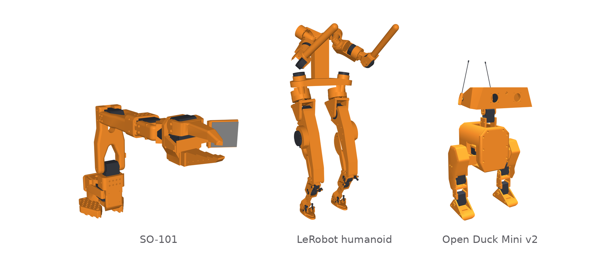
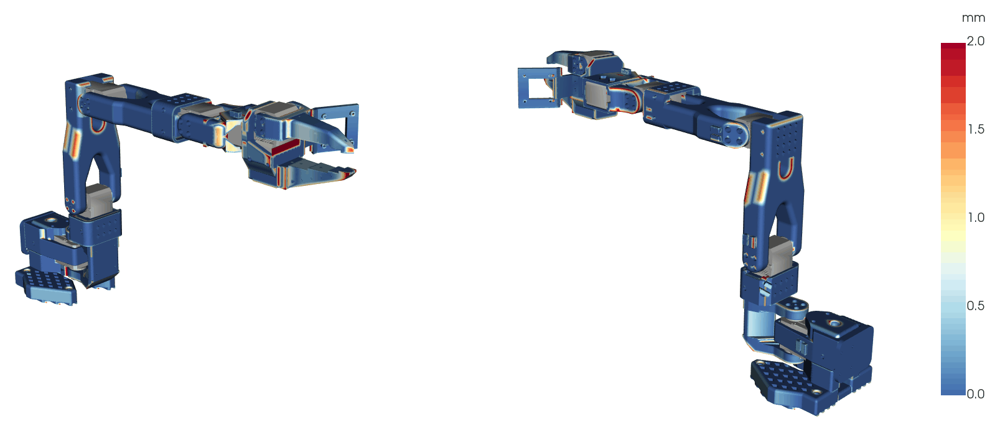
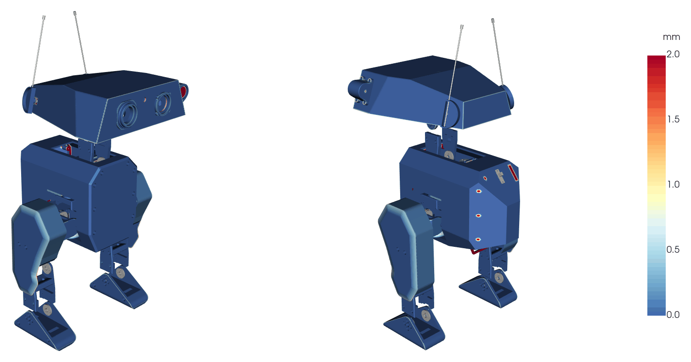
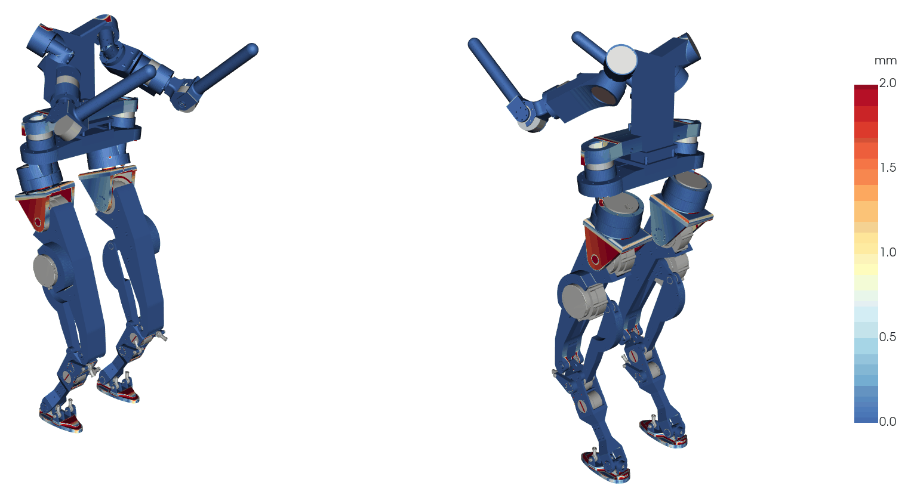

# Yo.Town Gym



*Orange: the printed parts, built from the programs in this repository. Grey: servos and other bought parts.*

This repository has the 3D-printed parts of three open-source robots, rewritten as CadQuery (Python)
programs.

Dimensions that several parts share are written in one place. For example, the servo's mounting
pattern is defined once, and every part that holds a servo uses it. Change it there, and all of those
parts change with it.

The same programs make the files you print and the meshes in the simulation model. Training tasks for
these robots will be added later.

| Robot | Upstream | Printed parts |
|---|---|---|
| [SO-101](robots/so101) | TheRobotStudio and Hugging Face, [SO-ARM100](https://github.com/TheRobotStudio/SO-ARM100) | 13 |
| [Open Duck Mini v2](robots/open_duck_mini_v2) | Antoine Pirrone and contributors, [Open_Duck_Mini](https://github.com/apirrone/Open_Duck_Mini) | 36 |
| [LeRobot humanoid](robots/lerobot_humanoid) | Hugging Face, [lerobot-humanoid-design](https://github.com/huggingface/lerobot-humanoid-design) | 34 |

These are first versions, and you can help make them better: see [CONTRIBUTING.md](CONTRIBUTING.md).

## Quick start

```sh
git clone https://github.com/yotown/gym && cd gym
pip install -e .                      # Python 3.11+: installs yotown.gym, CadQuery and the `gym` command
gym check so101                       # every part builds one valid solid
gym build so101 --step --stl          # build/so101/<part>.step and .stl, ready to print
```

With [uv](https://docs.astral.sh/uv/) instead of pip: `uv venv && uv pip install -e .`, or run a command
directly with `uv run gym check so101`.

The `gym` command comes with this repository; don't `pip install gym`, which is an unrelated package
(OpenAI Gym). If the command is not on your PATH, `python -m yotown.gym check so101` does the same.

To see what an edit does, change a shared value (for example the horn screw head size in
`robots/so101/shared.py`) and run:

```text
$ gym diff so101
changed    moving_jaw          +0.000 / -18.281 mm3   at x -7.8..7.8   y -7.8..2.5    z -24.0..24.0
changed    rotation_pitch      +0.000 / -43.542 mm3   at x -19.9..-4.5 y 0.2..6.5     z -7.8..7.7
changed    under_arm           +0.000 / -89.404 mm3   at x 57.1..72.6  y -39.8..-24.2 z -29.7..30.2
changed    upper_arm           +0.000 / -19.906 mm3   at x 57.3..72.8  y 4.2..19.8    z -31.7..-28.7
changed    wrist_roll_pitch    +0.000 / -82.872 mm3   at x -27.1..27.7 y -7.8..7.8    z 20.2..35.8
so101 since HEAD: 5 changed, 8 unchanged
```

## Software engineering, for hardware

| In software | Here |
|---|---|
| a library you depend on | `yotown.gym.vendors`: bought parts as classes, one folder per maker (Feetech and ROBOTIS servos, RobStride actuators, Raspberry Pi, Adafruit and Waveshare boards), with their facts and sources; standard bearings and inserts in `yotown.gym.standard` |
| an API | an interface: a bolt circle, a servo seat, a screw. One value, used by both parts it joins |
| a module | a part program: `robots/<robot>/parts/<part>.py` |
| configuration | `robots/<robot>/shared.py`: what a robot's parts share |
| inheritance, template method | a family: one part's program, run by its siblings with their own values |
| a build | `gym build`: STEP and STL per part |
| tests | `gym check`: every part builds one valid solid |
| a diff in review | `gym diff`: the material each part gains and loses, and where |
| semantic versioning | an interface change is a breaking change: a part printed before it won't fit after |

See [docs/design.md](docs/design.md) for how it fits together.

## The framework

Bought parts (servos, actuators, bearings) are Python classes with their dimensions from the maker's
datasheet, one folder per maker in [vendors/](vendors). The actuator classes also have their torque ratings.
Makers are welcome to list their own parts: see [vendors/README.md](vendors/README.md).


```python
from yotown.gym.vendors.feetech import STS3215

SERVO = STS3215()
SERVO.horn                 # BoltCircle(d=14.0, count=4, first_deg=45.0)
SERVO.horn.rotated(-2.8)   # the same horn pattern, turned 2.8 degrees

from yotown.gym.vendors.robstride import RS02, RS03
RS03.front_screws          # ScrewPattern(circle=BoltCircle(d=98.0, count=8, ...), thread='M4', depth=8.0)
RS03.peak_nm, RS02.peak_nm # 60.0, 17.0
```

Each robot has a `shared.py` for the values its parts share. A part reads it like this:

```python
from yotown.gym import shared

S = shared(__file__)                  # robots/so101/shared.py
SERVO, SERVO_SCREW = S.SERVO, S.SERVO_SCREW
...
arm = arm.cut(SERVO.horn.on(seat).circle(S.HORN_SCREW_HEAD_D / 2).extrude(depth))
```

Some parts are variants of another part. `motor_holder_base` runs `motor_holder_wrist`'s program with
its own servo height, adds a cable clip, and then cuts the servo pocket and screw holes, so the clip
does not block them.

All three robots use this. SO-101 and the Duck use the `STS3215` servo class. The LeRobot humanoid uses
two bearing classes (`B6702`, `B6207`), an M3 screw and the `RS03` actuator; the femur's bolt circle comes
from the RS03's flange. Each robot's `shared.py` also holds the dimensions where two of its parts meet.

## What a program looks like

Each part is one Python file in `robots/<robot>/parts/`. It opens with its parameters in two blocks:

```python
# -- interfaces -- fixed ------------------------------------------
SHAFT_D = 35.0              # bearing 35
SCREW_CIRCLE_R = 13.5       # the screws, on this circle about the shaft's axis
...
# -- body: free ---------------------------------------------------
ARM_H = 17.5                # the square arm's half width
FLARE_R = 12.5              # the arm flaring out into the fork
...
```

**Interfaces** are what other parts fit: bores, bolt circles, servo seats, faces against a neighbour.
They match the upstream's design exactly; change one only together with what it fits.
An interface whose comment says `not in the model: <what>` fits something the upstream's simulation model
doesn't draw (a screw's length, a bearing, a circuit board).
**Body** values shape the part between its interfaces; change them freely and the part still fits.

Each value has a descriptive name and is written once; other values are calculated from it.
Positions are in the part's own frame, the same as the upstream's model.

## How close they are to the originals

Each robot below is assembled from its programs, every part placed where the upstream's model puts the
original. Each printed part's surface is coloured by how far it is from the upstream's own mesh of that
part: blue lies on it, red is 2 mm or more away. Grey parts are bought (servos, bearings, boards) and are
not redrawn.







| Robot | Within 0.1 mm | Within 0.5 mm | Within 1 mm | Parts shown |
|---|---|---|---|---|
| SO-101 | 73 % | 90 % | 96 % | 13 of 13 |
| Open Duck Mini v2 | 85 % | 95 % | 97 % | 36 of 36 |
| LeRobot humanoid | 88 % | 93 % | 96 % | 32 of 34 |

The shares are of the printed parts' surface area. Parts the upstream's simulation model leaves out
(the Duck's eyes, lights and speaker mount; the LeRobot humanoid's torso plates) are put where the
upstream's assembly puts them, and measured against their own upstream STEP. SO-101's Seeed Studio plate
is the alternative to its Waveshare plate (one for each driver board), so the right-hand view shows it in
the Waveshare plate's place. The LeRobot humanoid's two ankle rods are not shown: the upstream draws them
at a different ankle angle from its model's.

Red areas are where the shape was simplified, for example a rounded edge left square or a curved
surface made flat. The mounting features (holes, seats, mating faces) match the original exactly, so a
printed part fits with the original ones.

## Build a part without the command

After `pip install -e .` (the parts import `yotown.gym` for their shared values):

```python
import runpy
import cadquery as cq

part = runpy.run_path("robots/so101/parts/upper_arm.py")["result"]
cq.exporters.export(part, "upper_arm.step")      # or .stl to print
```

Keep a robot's folder together: its parts read its `shared.py`, and a family's members run each other.

## Project folder structure

```text
src/yotown/gym/    the framework (import yotown.gym): interfaces, standard parts, the gym command
vendors/<maker>/   bought parts, one folder per maker (import yotown.gym.vendors.<maker>)
robots/<robot>/    shared.py, parts/<part>.py, the upstream's LICENSE and a NOTICE
tasks/             training tasks for the robots (planned)
docs/              the design (design.md), and the maps above (images/)
```

## Make them better

These programs are first versions. They build and fit, but many could be shorter and clearer. Ways to
help:

- **Fewer lines.** Use a pattern instead of repeated features, a mirror instead of a second half, and a
  primitive instead of a traced outline.
- **Parameters that mean something for a task.** Name what a task changes, such as an arm's reach, a
  gripper's opening, a leg's length or a wall's thickness for strength, and calculate the rest from it,
  so one change gives a consistent new part.
- **The red areas.** Put back a round or a curve that was simplified, if it matters to you.

Keep the interfaces exact. If you change one, change the part it fits in the same edit. Keep each value
named and written once, and make sure the part still builds as one valid solid.

Run `gym check` and `gym diff` before you open a pull request, and say what changed: the line count
before and after, or the new parameters and what they do. [CONTRIBUTING.md](CONTRIBUTING.md) has the rest.
Or write to help@yotown.com.

## Licences

Each robot's folder carries its upstream's licence (`LICENSE`) and a `NOTICE` naming the upstream.
The programs are derived from the upstream designs and are under those licences. Everything else here
(the yotown.gym package, this README and the images) is under the Apache License 2.0, in `LICENSE` at
the top. Bought parts (servos, bearings, screws, electronics) are not redrawn here.

## About

Made by Yo.Town 3D. If you want your own robot's parts as code, write to help@yotown.com.
